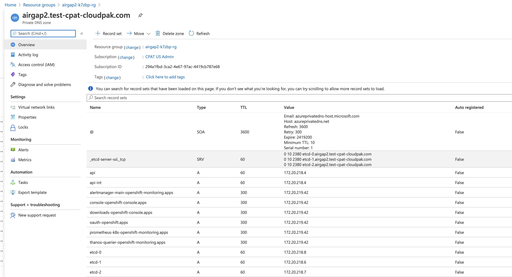

# Configure DNS without wildcards OpenShift

Conventional OCP installs use a wildcard record `*.apps.basedomain.cluster.basedomain.com` to redirect all routes towards the ingress load balancer

In some environments, you might prefer to manually create each route rather than using a wildcard. This document will walk you through that.

## Get all routes on the cluster

Run the following command which will return a list of all routes on the cluster. I've included the routes desired out of the box on a OCP 4.6 installation

```bash
oc get --all-namespaces -o jsonpath='{range .items[*]}{range .status.ingress[*]}{.host}{"\n"}{end}{end}'
```

```
oauth-openshift.apps.cluster.basedomain.com
console-openshift-console.apps.cluster.basedomain.com
downloads-openshift-console.apps.cluster.basedomain.com
alertmanager-main-openshift-monitoring.apps.cluster.basedomain.com
grafana-openshift-monitoring.apps.cluster.basedomain.com
prometheus-k8s-openshift-monitoring.apps.cluster.basedomain.com
```

## Add all desired routes to the private DNS zone

First create a couple of environment variables- 

```BASH
export IP_ROUTER=<ip-of-ingress-load-balancer>
export RESOURCE_GROUP=<resource-group>
export CLUSTER_NAME=<cluster-name>
export BASE_DOMAIN=<base-domain>
```

Now use the following commands to add these records to a private DNS zone. I'll include the command for the console's route,  but you'll have to run these for each route that were output in our last step.

```bash
az network private-dns record-set a create -g $RESOURCE_GROUP -z ${CLUSTER_NAME}.${BASE_DOMAIN} -n console-openshift-console.apps --ttl 300
az network private-dns record-set a add-record -g $RESOURCE_GROUP -z ${CLUSTER_NAME}.${BASE_DOMAIN} -n console-openshift-console.apps -a $PUBLIC_IP_ROUTER
```


You're done! take a look at your DNS zone in the Azure portal and the records should look like this-
